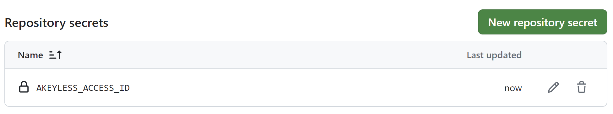

# Overview
# GitHub Actions Plugin
[Akeyless Official GitHub Actions ](https://github.com/marketplace/actions/akeyless-authentication-and-fetching-secrets), plugin enables you to automate workflows for your GitHub-hosted repositories. 

With the GitHub Actions plugin, you can fetch secrets directly from Akeyless into your workflows.

**Prerequisites**
Job permissions requirement: (Relevant for OAuth 2.0 / JWT Authentication only)
The default usage relies on using the GitHub JWT (JSON Web Token) to authenticate to Akeyless. To make this available, you must configure it inside your job workflow.

```YAML

jobs:
  my_job:
    #---------Required---------#
    permissions: 
      id-token: write
      contents: read
    #--------------------------#
```

**OAuth 2.0 / JWT**
**1. Create a new OAuth 2.0 / JWT Authentication Method using the CLI**

```Shell
akeyless create-auth-method-oauth2 --name /Identity/GitHubAuth  \
--jwks-uri https://token.actions.githubusercontent.com/.well-known/jwks \
--unique-identifier repository \
--force-sub-claims
```

**2. Create role** in `/MyVault/roles` 

```shell
akeyless create-role --name /MyVault/roles/GitHubRole
```
**3. Add access permission to role (mysqlDB dynamic secret)** 
`/MyVault/DBs/*`

```shell
akeyless set-role-rule --role-name /MyVault/roles/GitHubRole --path "/MyVault/DBs/*" \
--capability read --capability list --capability create  --capability update

```
**4. associate the role with github_auth**

```bash
 akeyless assoc-role-am --role-name /MyVault/roles/GitHubRole \
--am-name /Identity/GitHubAuth --sub-claims repository=brokedba/Akeyless_demo
 ```
**5. add Akeyless ACESS ID as repo secret**

